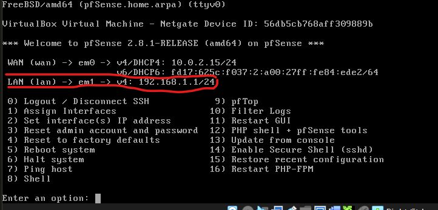

# Threatsphere Firewall configuration

##  Prerequisites
  - virtualbox 😃/VM ware ☹️
  - PFsense iso installed
  - A windows pc 

Please refer to [this](https://github.com/eth-hac-steven/Home-lab-Virtual-Machine-Setup/tree/main/PFsense%20Firewall%20Installation) to install the firewall iso in virtualbox

### PFsense  setup
- Device Setup
   - Make sure that the win pc and  PFsense are on the same LAN network 

- Start the Machines
- On PFsense you should see this

       

- Take note of the LAN IP address : 192.168.1.1/24
- On the Win system go to your browser
- Enter the IP address in the url bar
- This warning should come up
  
    

- Click ```Advance``` and continue
- which bring you to the login page


- The username : admin
- The password : pfsense
- foloow the general wizard setup
